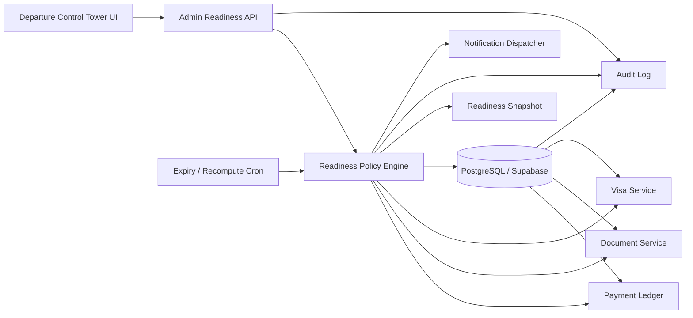

# Arsitektur Departure Control Tower

**Proyek:** travelumrohbonang  
**Status:** Rancangan implementasi  
**Cakupan utama:** dokumen, visa, pembayaran, kesiapan keberangkatan, dan exception handling  
**Penulis:** Manus AI

## 1. Tujuan dan hasil yang diharapkan

Departure Control Tower adalah satu pusat kendali operasional untuk menjawab pertanyaan: **apakah suatu keberangkatan siap diberangkatkan, siapa yang masih menjadi blocker, apa penyebabnya, dan tindakan apa yang harus dilakukan berikutnya?**

Sistem tidak boleh menyimpulkan bahwa booking telah lunas hanya karena status booking `confirmed`. Status `confirmed` berarti kursi ditahan, sedangkan kesiapan finansial harus dihitung dari pembayaran yang tercatat dan tidak dibatalkan pada ledger. Dengan prinsip ini, booking confirmed yang belum lunas tetap muncul sebagai receivable dan blocker pembayaran.

Control Tower harus bekerja pada dua tingkat:

| Tingkat | Tujuan | Unit analisis |
|---|---|---|
| **Departure-level** | Menentukan apakah satu keberangkatan siap | `departure_id` |
| **Pilgrim-level** | Menunjukkan siapa yang harus ditindaklanjuti | `pilgrim_id` dan `booking_id` |

## 2. Aktor dan tanggung jawab

| Aktor | Tanggung jawab utama | Akses yang disarankan |
|---|---|---|
| Super Admin | Mengubah kebijakan blocker, override terbatas, dan melihat seluruh cabang | Global read/write dengan audit penuh |
| Finance | Memverifikasi pembayaran, piutang, refund, dan rekonsiliasi | Finance scope; tidak boleh mengubah dokumen/visa |
| Operasional | Menindaklanjuti dokumen, visa, kursi, manifest, dan check-in | Operational scope; tidak boleh memverifikasi pembayaran |
| Branch Manager | Mengelola keberangkatan dalam cabangnya | Branch scope |
| Agent | Melihat status jemaah yang menjadi tanggung jawabnya | Read-only terbatas |
| Auditor | Melihat status, histori, dan bukti perubahan | Read-only dengan export |

Setiap perubahan status wajib menyimpan `actor_id`, waktu, status sebelum, status sesudah, alasan, dan referensi bukti apabila ada. Override manual tidak boleh menghapus blocker asli; override hanya menambahkan keputusan dan masa berlaku.

## 3. Model status terpadu

### 3.1 Status domain

Status domain tetap dipisahkan agar data sumber tidak kehilangan makna.

| Domain | Status minimum |
|---|---|
| Pembayaran booking | `unpaid`, `partial`, `paid`, `overdue`, `disputed`, `refunded` |
| Dokumen | `missing`, `uploaded`, `under_review`, `verified`, `rejected`, `expired` |
| Visa | `not_started`, `submitted`, `under_review`, `approved`, `rejected`, `expired`, `not_required` |
| Keberangkatan | `draft`, `open`, `locked`, `ready`, `departed`, `closed`, `cancelled` |

Status agregat keberangkatan bukan pengganti status domain. Status agregat dihitung oleh mesin readiness berdasarkan policy keberangkatan.

### 3.2 Status readiness

| Status agregat | Definisi |
|---|---|
| `not_ready` | Terdapat blocker kritis atau data wajib belum tersedia |
| `at_risk` | Tidak ada blocker kritis, tetapi ada blocker tinggi/menengah atau tenggat dekat |
| `ready_with_exceptions` | Semua syarat wajib terpenuhi, tetapi terdapat pengecualian yang telah disetujui |
| `ready` | Semua policy wajib terpenuhi dan tidak ada exception aktif |
| `departed` | Keberangkatan telah dikunci dan tanggal keberangkatan terlewati |

## 4. Arsitektur komponen



**Readiness API** menjadi satu-satunya sumber data dashboard. Frontend tidak menghitung KPI dari daftar booking dan tidak mengambil langsung tabel privileged. **Policy Engine** menghitung blocker dengan query server-side, menyimpan snapshot bila diperlukan untuk audit/performa, dan menerbitkan event perubahan readiness.

## 5. Model data yang disarankan

Tabel yang sudah ada tetap menjadi sumber domain. Tambahkan tabel agregasi berikut.

### 5.1 `departure_readiness_policies`

Menyimpan aturan per keberangkatan atau per tipe paket.

| Kolom | Tipe konseptual | Keterangan |
|---|---|---|
| `id` | text | Primary key |
| `departure_id` | text nullable | Policy khusus keberangkatan |
| `package_id` | text nullable | Default policy paket |
| `payment_required` | boolean | Pembayaran lunas wajib atau tidak |
| `documents_required` | jsonb | Contoh: `paspor`, `vaksin` |
| `visa_required` | boolean | Apakah visa wajib |
| `visa_deadline_days` | integer | Batas relatif terhadap tanggal berangkat |
| `seat_assignment_required` | boolean | Kursi wajib ditetapkan |
| `checkin_required` | boolean | Check-in wajib sebelum lock |
| `critical_domains` | jsonb | Domain yang menghasilkan blocker kritis |
| `active` | boolean | Policy aktif |
| `version` | integer | Versi aturan |
| `created_by`, `created_at` | text/timestamp | Audit |

### 5.2 `departure_readiness_items`

Menyimpan hasil per jemaah agar operator dapat langsung menindaklanjuti.

| Kolom | Tipe konseptual | Keterangan |
|---|---|---|
| `id` | text | Primary key |
| `departure_id` | text | Keberangkatan |
| `booking_id` | text | Booking terkait |
| `pilgrim_id` | text nullable | Jemaah terkait |
| `domain` | text | `payment`, `document`, `visa`, `seat`, `checkin`, `manifest` |
| `code` | text | Contoh `payment_balance`, `passport_missing` |
| `severity` | text | `critical`, `high`, `medium`, `low` |
| `status` | text | `open`, `resolved`, `waived`, `expired` |
| `title` | text | Judul operator |
| `detail` | text/jsonb | Detail aman untuk UI |
| `due_at` | timestamp nullable | Tenggat tindakan |
| `source_updated_at` | timestamp | Waktu data sumber terakhir berubah |
| `resolved_at`, `resolved_by` | timestamp/text | Resolusi |
| `created_at`, `updated_at` | timestamp | Audit teknis |

Gunakan unique key konseptual pada `(departure_id, booking_id, pilgrim_id, domain, code)` agar recompute idempotent.

### 5.3 `departure_readiness_snapshots`

Menyimpan ringkasan pada waktu tertentu.

| Kolom | Keterangan |
|---|---|
| `departure_id` | Identitas keberangkatan |
| `status` | Status agregat |
| `score` | Nilai untuk indikasi, bukan satu-satunya keputusan |
| `critical_count` | Jumlah blocker kritis |
| `high_count` | Jumlah blocker tinggi |
| `domain_summary` | JSON ringkasan pembayaran/dokumen/visa |
| `computed_at` | Waktu kalkulasi |
| `policy_version` | Versi policy yang digunakan |

Snapshot tidak boleh dianggap sebagai sumber kebenaran permanen. Untuk aksi penting, API dapat memvalidasi ulang sumber domain sebelum mengunci keberangkatan.

### 5.4 `departure_readiness_overrides`

Override harus eksplisit, terbatas waktu, dan diaudit.

| Kolom | Keterangan |
|---|---|
| `readiness_item_id` | Blocker yang di-override |
| `reason` | Alasan wajib |
| `approved_by` | Role yang menyetujui |
| `expires_at` | Override otomatis kedaluwarsa |
| `evidence_url` | Bukti bila diperlukan |
| `created_at` | Waktu persetujuan |

## 6. Mesin blocker

### 6.1 Prinsip perhitungan

Mesin blocker menerima `departure_id`, memuat policy aktif, kemudian menghitung status dari sumber domain. Proses harus **idempotent**, **server-side**, dan **repeatable**. Mengubah status booking saja tidak cukup untuk menyatakan pembayaran lunas.

Urutan perhitungan yang disarankan:

1. Ambil departure dan policy aktif.
2. Ambil booking aktif dengan status yang menahan kursi, termasuk `confirmed` yang masih dalam masa berlaku.
3. Agregasikan pembayaran dari `booking_payments` yang `is_voided = false`.
4. Agregasikan dokumen wajib per jemaah dari status terbaru.
5. Agregasikan status visa dari record visa atau status workflow yang berlaku.
6. Hitung item kursi, manifest, dan check-in bila diwajibkan policy.
7. Upsert `departure_readiness_items`.
8. Tandai item yang tidak lagi berlaku sebagai `resolved` atau `expired`.
9. Hitung status agregat dan simpan snapshot.
10. Kirim notifikasi hanya untuk perubahan material atau reminder yang memenuhi cooldown.

### 6.2 Contoh aturan pembayaran

```text
paid_amount = SUM(booking_payments.amount WHERE is_voided = false)
balance = MAX(total_price - paid_amount, 0)

if balance = 0:
    payment_status = paid
else if paid_amount > 0:
    payment_status = partial
else:
    payment_status = unpaid

if booking.status = confirmed AND balance > 0:
    blocker = payment_balance
    severity = high atau critical berdasarkan policy dan days_until_departure
```

`confirmed` tetap menahan kursi, tetapi tidak boleh menghapus blocker pembayaran.

### 6.3 Contoh aturan dokumen dan visa

Untuk setiap jemaah, mesin membuat blocker terpisah agar tindakan dapat diarahkan dengan tepat.

| Kondisi | Code | Severity awal |
|---|---|---|
| Paspor belum diunggah | `passport_missing` | High |
| Paspor ditolak | `passport_rejected` | High |
| Paspor kedaluwarsa atau melewati batas minimum | `passport_expired` | Critical |
| Visa belum diajukan | `visa_not_submitted` | High |
| Visa ditolak | `visa_rejected` | Critical |
| Visa belum approved mendekati tenggat | `visa_deadline_risk` | Critical |
| Visa tidak diperlukan menurut policy | Tidak membuat blocker | None |

Status `verified` tidak boleh hanya berarti file tersedia; harus berarti file telah melewati pemeriksaan yang ditetapkan organisasi.

### 6.4 Agregasi status

Status `ready` hanya boleh tercapai apabila tidak ada blocker `critical` atau `high` yang terbuka, semua domain wajib memiliki data, dan tidak ada policy yang belum dievaluasi. `score` boleh ditampilkan untuk membantu prioritas, tetapi keputusan lock harus berbasis aturan blocker, bukan rata-rata persentase.

## 7. Kontrak API

### 7.1 Ringkasan departure

```http
GET /api/admin/departures/:departureId/control-tower
```

Response konseptual:

```json
{
  "departure": {
    "id": "dep-1",
    "packageTitle": "Umroh Reguler",
    "departureDate": "2026-10-12",
    "daysUntil": 51,
    "status": "open"
  },
  "readiness": {
    "status": "at_risk",
    "score": 82,
    "criticalCount": 1,
    "highCount": 12,
    "computedAt": "2026-08-22T06:00:00.000Z",
    "policyVersion": 3
  },
  "domains": {
    "payment": { "total": 40, "paid": 31, "partial": 6, "unpaid": 3, "balance": 125000000 },
    "documents": { "total": 120, "complete": 108, "incomplete": 12 },
    "visa": { "total": 40, "approved": 37, "inProgress": 2, "blocked": 1 }
  },
  "blockers": {
    "total": 15,
    "critical": 1,
    "high": 12,
    "medium": 2
  }
}
```

### 7.2 Daftar blocker dengan filter

```http
GET /api/admin/departures/:departureId/readiness-items?domain=payment&severity=high&status=open&limit=50&offset=0
```

Endpoint harus mendukung filter domain, severity, status, pencarian nama/kode booking, due date, branch scope, dan pagination. Response harus menyertakan `nextOffset` atau cursor.

### 7.3 Recompute

```http
POST /api/admin/departures/:departureId/control-tower/recompute
```

Endpoint ini harus aman diulang, rate-limited, dan mengembalikan `snapshot_id`, jumlah item dibuat/diperbarui/diselesaikan, serta waktu kalkulasi. Untuk request biasa, dashboard memakai snapshot terbaru; recompute manual digunakan setelah import pembayaran, perubahan visa, atau batch dokumen.

### 7.4 Resolve atau waive blocker

```http
POST /api/admin/readiness-items/:itemId/resolve
POST /api/admin/readiness-items/:itemId/waive
```

`resolve` hanya boleh dilakukan jika sumber domain sudah memenuhi syarat. `waive` memerlukan role, alasan, masa berlaku, dan bila kritis memerlukan persetujuan Super Admin atau dua-person approval.

### 7.5 Lock keberangkatan

```http
POST /api/admin/departures/:departureId/lock
```

Sebelum lock, server wajib melakukan recompute atau validasi snapshot yang masih segar. Request ditolak jika blocker kritis/tinggi masih terbuka tanpa override aktif. Semua penolakan dan lock dicatat pada audit log.

## 8. Rancangan UI operator

### 8.1 Header dan status utama

Bagian atas menampilkan paket, tanggal keberangkatan, countdown, branch, status keberangkatan, status readiness, waktu kalkulasi terakhir, dan tombol **Recompute**. Tombol lock harus menampilkan hasil preflight sebelum konfirmasi.

### 8.2 Kartu domain

Gunakan tiga kartu utama yang selalu konsisten:

| Kartu | Isi |
|---|---|
| Pembayaran | Lunas, partial, unpaid, total piutang, aging terburuk |
| Dokumen | Lengkap, belum ada, ditolak, expired |
| Visa | Approved, submitted, rejected, deadline risk |

Setiap kartu memiliki link ke daftar blocker yang sudah terfilter, bukan hanya angka dekoratif.

### 8.3 Daftar blocker prioritas

Tabel utama diurutkan berdasarkan severity, due date, dan jumlah hari menuju keberangkatan. Kolom minimal: severity, domain, nama jemaah, booking code, blocker, nilai/ketentuan, due date, owner, status, dan aksi.

Aksi yang tersedia harus kontekstual. Blocker pembayaran menyediakan tautan ke detail piutang; blocker dokumen membuka detail dokumen; blocker visa membuka workflow visa. Operator tidak boleh menyelesaikan blocker dari UI tanpa memperbarui sumber domain atau membuat override yang diaudit.

### 8.4 Tampilan per jemaah

Drawer atau halaman detail jemaah menampilkan timeline terpadu: booking dibuat, pembayaran, upload/verifikasi dokumen, pengajuan visa, perubahan status, dan notifikasi. Timeline ini membantu operator memahami akar masalah tanpa membuka banyak halaman terpisah.

## 9. Notifikasi dan ownership

Setiap blocker harus memiliki owner domain dan aturan reminder.

| Domain | Owner | Reminder contoh |
|---|---|---|
| Pembayaran | Finance/PIC | H-30, H-14, H-7, lalu escalation |
| Dokumen | Operasional/PIC | Saat missing/rejected dan H-14 |
| Visa | Visa officer/Operasional | Saat submitted terlalu lama dan mendekati deadline |

Gunakan notification outbox agar pengiriman tidak terjadi di dalam transaksi utama. Outbox menyimpan `event_type`, `recipient`, `channel`, `dedupe_key`, `attempt_count`, `next_attempt_at`, dan status. `dedupe_key` mencegah pesan ganda saat recompute diulang.

## 10. Keamanan dan audit

API Control Tower wajib menggunakan `requireAuth`, role/scope guard, dan validasi `departure_id` terhadap branch/agent scope. Data sensitif seperti nomor paspor dan bukti pembayaran tidak boleh masuk ke log biasa. Response daftar blocker sebaiknya mem-mask data yang tidak diperlukan untuk tindakan.

Event audit minimum meliputi `readiness_recomputed`, `blocker_resolved`, `blocker_waived`, `policy_changed`, `departure_lock_attempted`, `departure_locked`, dan `departure_lock_rejected`. Setiap event menyimpan actor, target, request ID, IP, metadata ringkas, serta hasil.

## 11. Performa dan konsistensi

Dashboard membaca snapshot agar halaman tidak menjalankan banyak agregasi berat pada setiap render. Recompute dipicu oleh event perubahan penting dan cron periodik, misalnya setiap jam untuk expiry dan deadline. Untuk aksi lock, lakukan validasi sinkron terakhir.

Cache atau snapshot harus memiliki TTL. Jika snapshot terlalu lama, UI menampilkan label **Data mungkin stale** dan menyediakan tombol recompute. Query per domain harus menghindari N+1; gunakan agregasi SQL atau batch query berdasarkan seluruh `booking_id` dan `pilgrim_id` departure.

## 12. Roadmap implementasi

### Tahap 1 — Read model dan API ringkasan

Pertahankan tabel domain yang ada. Tambahkan endpoint `control-tower`, query agregasi payment/document/visa, tipe response, dan test untuk confirmed unpaid. Target selesai ketika satu departure dapat menampilkan ringkasan konsisten tanpa perhitungan browser.

### Tahap 2 — Readiness items dan blocker detail

Tambahkan tabel `departure_readiness_items`, service recompute idempotent, pagination/filter endpoint, dan UI daftar blocker. Target selesai ketika operator dapat mengidentifikasi setiap jemaah yang menjadi blocker dan domain penyebabnya.

### Tahap 3 — Policy dan exception

Tambahkan policy versioning, override terbatas, expiry override, two-person approval untuk blocker kritis, serta preflight lock. Target selesai ketika sistem dapat menolak keberangkatan yang belum memenuhi syarat dan menyediakan alasan yang dapat diaudit.

### Tahap 4 — Visa, notifikasi, dan outbox

Hubungkan status visa aktual, scheduler deadline, notification outbox, deduplikasi, retry, dan escalation owner. Target selesai ketika perubahan status visa atau pembayaran menghasilkan blocker dan reminder yang konsisten.

### Tahap 5 — Production rollout

Jalankan migration pada staging terlebih dahulu, lakukan backfill read model, bandingkan hasil dengan laporan lama, aktifkan feature flag untuk internal users, kemudian rollout bertahap ke branch. Sediakan rollback dengan menonaktifkan feature flag dan mempertahankan tabel baru tanpa menghapus data sumber.

## 13. Kriteria penerimaan

| Area | Kriteria penerimaan |
|---|---|
| Pembayaran | Confirmed unpaid tetap memegang kursi, muncul sebagai blocker dan piutang; paid hanya berdasarkan ledger non-voided |
| Dokumen | Dokumen wajib missing/rejected/expired menghasilkan item yang dapat ditindaklanjuti |
| Visa | Status visa dan deadline menghasilkan blocker terpisah dari dokumen umum |
| Konsistensi | Recompute dua kali menghasilkan hasil sama dan tidak menggandakan item/notifikasi |
| Scope | User hanya melihat departure dan jemaah sesuai branch/role scope |
| Lock | Lock ditolak bila blocker kritis/tinggi terbuka, kecuali override sah dan belum kedaluwarsa |
| Audit | Perubahan policy, resolve, waive, recompute, dan lock tercatat |
| Performa | Dashboard tidak mengambil seluruh data lalu menghitung KPI di browser |
| Resiliensi | Kegagalan notifikasi tidak menggagalkan update domain/readiness |
| Test | Tersedia unit test policy, integration test endpoint, dan UI test untuk filter serta blocker state |

## 14. Rekomendasi keputusan desain

Gunakan **readiness item sebagai unit kerja utama**, bukan hanya score. Score membantu orientasi, tetapi operator membutuhkan daftar tindakan yang jelas. Jadikan payment ledger, document workflow, dan visa workflow sebagai sumber kebenaran masing-masing; Control Tower hanya mengagregasikan dan mengarahkan tindakan.

Untuk tahap pertama, jangan langsung membuat microservice terpisah. Implementasikan `readinessService` di API server yang sudah ada, gunakan job terjadwal untuk recompute, dan pisahkan read model melalui tabel snapshot/items. Pemisahan service dapat dipertimbangkan setelah volume departure, event, atau kebutuhan integrasi eksternal membenarkannya.

## Referensi internal

[1]: `artifacts/api-server/src/routes/admin/departures.ts` — endpoint daftar departure, manifest, dan readiness yang sudah ada.

[2]: `artifacts/api-server/src/routes/admin/bank-reconciliation.ts` — fondasi rekonsiliasi bank dan matching ke `booking_payments`.

[3]: `lib/db/src/schema/bookings.ts` — schema booking, booking pilgrims, dan booking payments.

[4]: `lib/db/src/schema/payments.ts` — schema pembayaran, gateway transaction, dan installment schedule.

[5]: `lib/db/src/schema/contracts.ts` — schema refund request.

[6]: `lib/db/src/schema/agents.ts` — schema komisi dan withdrawal agen.

[7]: `artifacts/umroh-app/src/features/admin/pages/DepartureReadiness.tsx` — UI readiness yang sudah ada.
