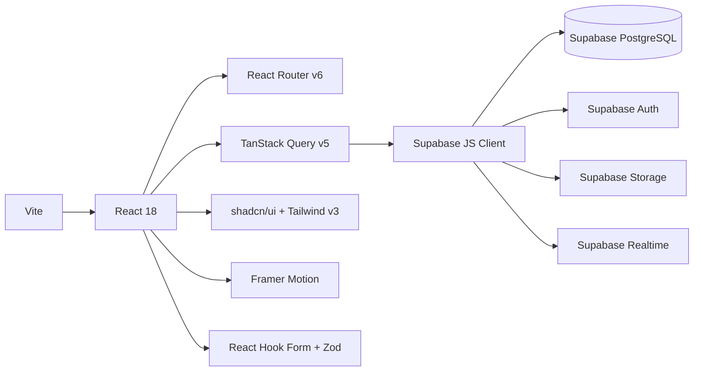

# Architecture
**Umroh Gateway** | Diperbarui: 2026-07-01

---

## Gambaran Sistem

Platform travel umroh **all-in-one**: B2C (jamaah), B2B (agen/mitra), dan multi-tenant (cabang/reseller).

**Backend runtime terdiri dari dua bagian:**
- **Supabase** — sumber kebenaran utama: database (PostgreSQL + RLS), Auth, Storage, Realtime, dan Edge Functions untuk operasi khusus (payment gateway, email, cron webhook)
- **`api-server`** (Express) — server ringan yang berjalan di Replit sebagai Replit artifact; saat ini hanya berperan sebagai health-check endpoint dan proxy tambahan jika dibutuhkan. Semua CRUD bisnis langsung ke Supabase dari frontend, bukan melalui `api-server`.

```
┌─────────────────────────────────────────────────────────────┐
│                        BROWSER / CLIENT                     │
│                                                             │
│  ┌──────────────┐  ┌──────────────┐  ┌───────────────────┐ │
│  │  Jamaah SPA  │  │  Admin Panel │  │  Tenant Site      │ │
│  │  (React/Vite)│  │  (React/Vite)│  │  (subdomain/slug) │ │
│  └──────┬───────┘  └──────┬───────┘  └─────────┬─────────┘ │
└─────────┼─────────────────┼───────────────────┼────────────┘
          │                 │                   │
          ▼                 ▼                   ▼
┌─────────────────────────────────────────────────────────────┐
│                    SUPABASE (BaaS)                          │
│                                                             │
│  ┌─────────────┐  ┌──────────────┐  ┌───────────────────┐  │
│  │  PostgreSQL  │  │  Auth        │  │  Storage          │  │
│  │  + RLS       │  │  + 2FA TOTP  │  │  (5 buckets)      │  │
│  └─────────────┘  └──────────────┘  └───────────────────┘  │
│                                                             │
│  ┌─────────────┐  ┌──────────────┐  ┌───────────────────┐  │
│  │  Realtime   │  │  Edge Funcs  │  │  pg_cron          │  │
│  │  (Chat)     │  │  (13 funcs)  │  │  (2 cron jobs)    │  │
│  └─────────────┘  └──────────────┘  └───────────────────┘  │
└─────────────────────────────────────────────────────────────┘
          │
          ▼
┌─────────────────────────────────────────────────────────────┐
│                THIRD-PARTY SERVICES                         │
│                                                             │
│  Midtrans/Xendit (payment)  │  Resend (email transaksional) │
│  Fonnte/Wablas (WhatsApp)   │  Sentry (error tracking)      │
│  Cloudflare Turnstile (CAPTCHA)                             │
└─────────────────────────────────────────────────────────────┘
```

---

## Alur Utama: Booking Jamaah

```
Jamaah                   Frontend                  Supabase
  │                         │                          │
  │── Browse paket ─────────▶│                          │
  │                         │── SELECT packages ───────▶│
  │                         │◀─ data paket ─────────────│
  │◀─ tampil daftar ─────────│                          │
  │                         │                          │
  │── Pilih paket ──────────▶│                          │
  │── Isi data jamaah ──────▶│ (Zod validate)           │
  │── Submit booking ────────▶│                          │
  │                         │── INSERT bookings ────────▶│
  │                         │── INSERT booking_pilgrims ─▶│
  │                         │◀─ booking_code ────────────│
  │◀─ sukses + kode ─────────│                          │
  │                         │                          │
  │── Upload bukti bayar ───▶│                          │
  │                         │── Storage upload ─────────▶│
  │                         │── INSERT payments ────────▶│
  │                         │◀─ OK ──────────────────────│
  │◀─ menunggu verifikasi ───│                          │
```

---

## Alur Pembayaran Gateway (Midtrans/Xendit)

```
Frontend ──── POST /payment-gateway (Edge Func) ────▶ Midtrans/Xendit
                                                              │
                                              payment page / token
                                                              │
Jamaah ◀──────────────────── redirect ke payment page ────────┘
                                                              │
Midtrans/Xendit ── webhook POST /payment-webhook (Edge Func) ─▶ Supabase
                                                              │
                                              UPDATE payments SET status = 'verified'
```

---

## Alur Auth & Role

```
User login
    │
    ▼
Supabase Auth (email + password + optional TOTP)
    │
    ▼
onAuthStateChange callback (useAuth hook)
    │
    ▼
checkRole() ──▶ SELECT dari user_roles ──▶ return role
    │
    ├── buyer         → /dashboard (jamaah)
    ├── agent         → /agent-portal
    ├── branch_manager → /branch-dashboard
    ├── admin         → /admin
    └── super_admin   → /admin (full access)
```

---

## Lokasi Edge Functions

Edge Functions sumber asli ada di `.migration-backup/supabase/functions/` (dari Vercel/Lovable).  
Target setelah migrasi penuh: dipindah ke `supabase/functions/` dan di-deploy via `supabase functions deploy`.

---

## Stack & Dependensi Utama



---

## Multi-Tenant

Setiap tenant (cabang/reseller) memiliki `tenant_sites` record yang menyimpan:
- Domain/slug unik
- Branding (nama, logo, warna)
- Pengaturan SEO
- Paket yang ditampilkan

Routing tenant dilakukan di level frontend: deteksi hostname/slug → load setting tenant → render dengan branding yang sesuai.

---

## Cron Jobs (pg_cron)

| Job | Jadwal | Edge Function | Fungsi |
|-----|--------|---------------|--------|
| payment-reminder | Daily 09:00 WIB | `payment-reminder` | Notif booking belum bayar |
| follow-up-reminder | Daily 09:00 WIB | `follow-up-reminder` | Notif CRM lead yang perlu follow-up |

---

## Error Tracking

Sentry SDK terpasang dengan `ErrorBoundary` di root App.  
Aktif jika `VITE_SENTRY_DSN` tersedia. Tanpa DSN, error tetap dicatat ke `error_logs` table di Supabase via `src/lib/errorLogger.ts`.
